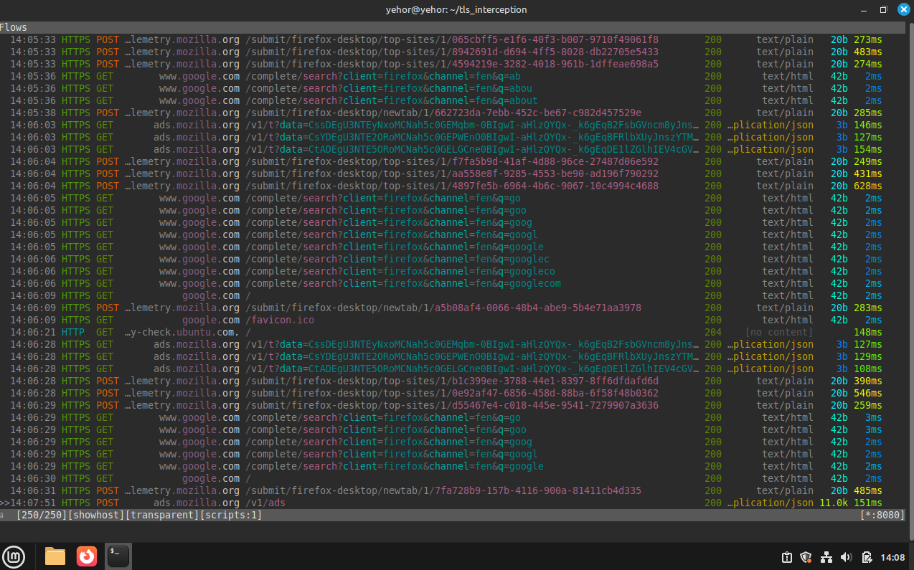
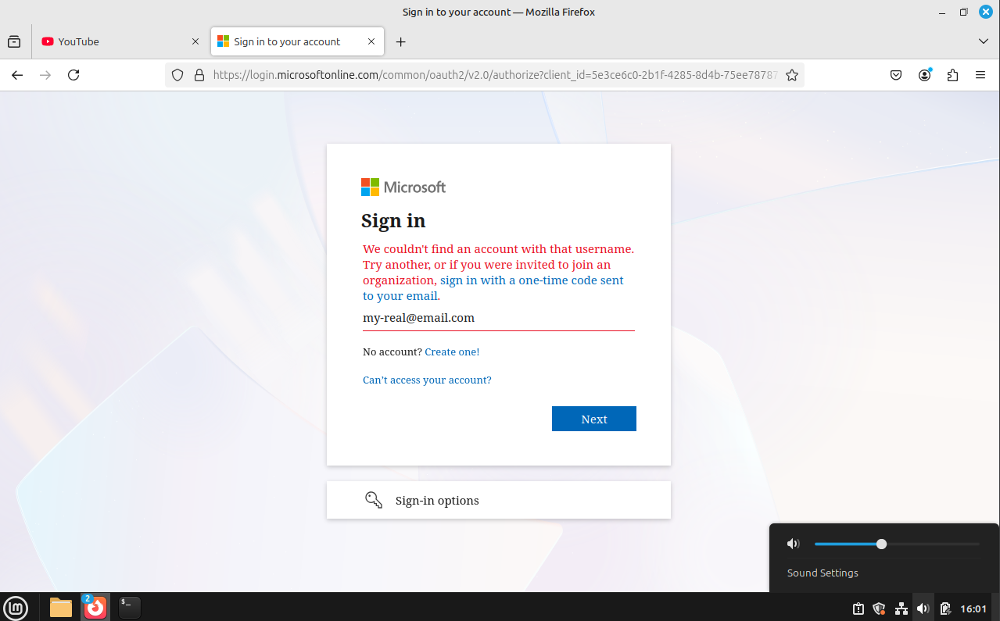
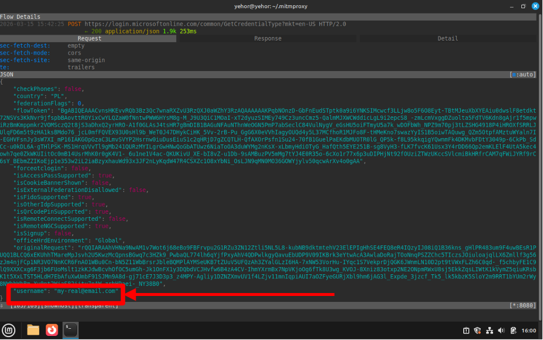
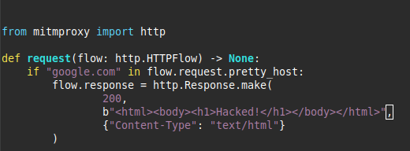
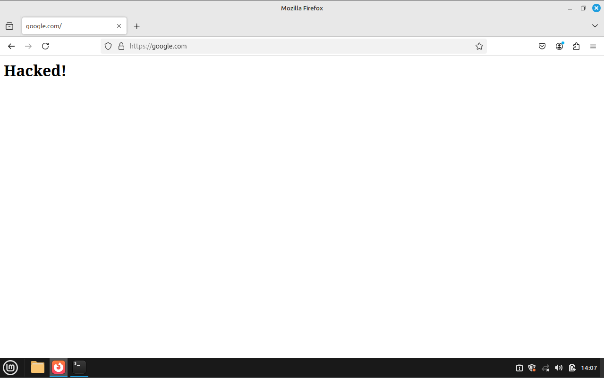

### 1. View from proxy
Once the transparent proxy was fully functional, I was able to see every request made by the browser in real-time. Even though the browser is using HTTPS, the custom CA allows us to decrypt the TLS handshake.

### 2. Credential Visibility
To demonstrate the risk of a compromised trusted CA, I attempted to sign into a Microsoft account on the Client VM. Because the Gateway is performing Deep Packet Inspection (DPI), the "secure" connection is actually terminated at the proxy and then "renewed"

Step A: The user enters their email on what looks like a secure Microsoft login page.

Step B: mitmproxy captures the POST request containing the plaintext credentials.

### 3. Content Manipulation
- Using a Python script (scripts/redirect.py), I faked the response from google.com and replaced the HTML body

- The result is a "Hacked" version of Google. Note that the browser still shows a valid lock icon, because the certificate is signed by trusted custom CA (mitmproxy).
