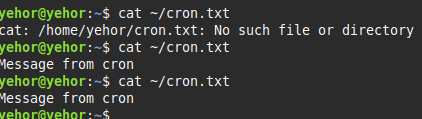
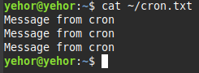

## user-specific cron jobs
1. check if any cron jobs exist for the user: 
```
crontab -l
```
2. create new cron job:
```
crontab -e
```
3. add new cron job:
```
1 * * * * echo "Message from cron" > ~/cron.txt
```
4. note: I though it meant run every minute, it means run every first minute of every hour. Should be * instead of 1 for every minute
```
* * * * * echo "Message from cron" > ~/cron.txt
```
5. after verification (`cat ~/cron.txt`) contents appear there:

6. changed from overwrite (>) to append (>>) to see the effects. The messages appear:

7. deleted crontab with `crontab -r`. Note: it wipes entire crontab, to delete cron job just edit the file manually