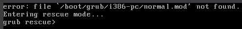

## Breaking the system and observing the damage locally
1. take a snapshot of VM as back up
2. run sudo rm -rf / to see what damage it does to the system (in particular I wanna mount the drive in another VM and see what's left of it)
3. ran the command, ran into a fail-safe, need to add --no-preserve-root option to make it work
4. tons of files report operation not permitted, I wonder why that is. I guess some of it might be kernel related stuff but still root privelege is not enough? And why are kernel-related things stored on the main filesystem, I thought it on another fs that isn't mounted be default but exists on a disk's partition
5. some of the GUI elements still work like calendar and audio toggle bar, restarting system to see if it's still bootable
6. the system isn't bootable, entered grub rescue mode by default:


## Observing the damage from another VM
0. add the vdi to another vm via settings
1. discover correct disk (see what's not mounted)
```
lsblk -f
```
2. mount the disk to observe the damage
```
sudo mkdir /mnt/broken_system/ && sudo mount /dev/sda /mnt/broken_system/
```
3. there's quite a lot left and not just empty directories, I found many files with `find . -type f` after navigating into root directory of a mounted fs
4. apparently things are left because some of them are read-only `windows` into BIOS/EUFI settings, some things are needed for rm command to function, can't delete those. But There's still more left. Oh, and some dirs are actually dynamic virtual filesystems which are revived by kernel (e.g /dev with device files)
5. apparently there's also a thing called immutable attribute which means that even root can't modify a file directly (but root can take away that bit and then do whatever he wants)
6. also running `sudo rm -rf ./*` after the fs has been mounted not at / worked perfectly as expected, everything is wiped. I wonder what happens when I try to actually boot it. The same grub rescue mode, nothing interesting. Restoring snapshot...